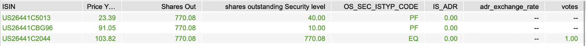
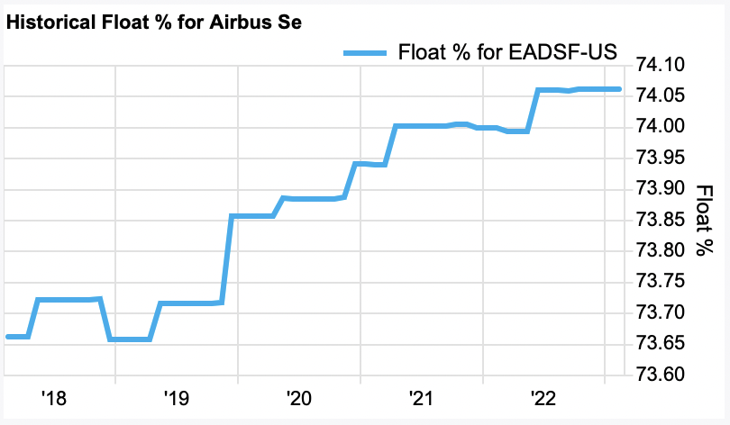
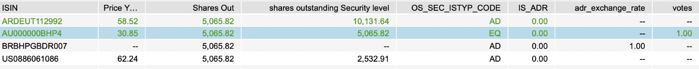

# Share Ownership Weighting and Share Class Inclusion in PACTA

PACTA methodology note  
**Share Ownership Weighting and Share Class Inclusion in PACTA**

Prepared by Nicholas Dodd

## 1. Background

### 1.1 Ownership-based attribution methods

In order to attribute an investee companies production or climate
alignment results to a financial portfolio a weighting method is
required. This methodology note describes the share ownership
attribution method for listed equity holdings. This weighting method is
based on the individual shares owned by an investor.

Other possible weighting methods for listed equity include equity
ownership, which weights based on the market value of the shares held,
and voting influence, which weights based on the number of AGM votes
associated with the shares held.

### 1.2 Defining share ownership

Share ownership in the context of PACTA refers to the act of holding a
proportion of the publicly listed shares of a given company. Each share,
also sometimes referred to as stock, represents an ownership stake in
the company that confers the holder with rights to a share of the
dividends and/or influence on company decision making.

## 2. The share ownership weight attribution method

The share ownership weight method is one of several methods that can be
used to attribute a companies production or climate performance to a
financial portfolio based on the percentage of a companies outstanding
public shares that are held.

For holdings in a given entity, share ownership weight is defined as the
total number of outstanding shares in all classes of shares within scope
held by the investor (the numerator) divided by the total number of
outstanding shares for the entity across all listed security issuance
for the entity (the denominator). Each listed security issuance is
denoted by an ISIN in the dataset.

$$Share\ ownership\ weight = \frac{\sum outstanding\ shares\ held\ by\ the\ investor\ \left( SC_{eq} + SC_{pf} + SC_{dl} + SC_{cp} + \left( SC_{ad} \times AD_{cf} \right) \right)}{\sum outstanding\ shares\ of\ the\ entity\ \left( SC_{eq} + SC_{pf} + SC_{cp} \right)}$$
Where:  
$SC_{ST}$ are the Share Class and Share Type of each security held by an
investor (see table 2.1) $AD_{cf}$ is the conversion factor required to
derive the number of ordinary shares from the number of depositary note
shares

As the number of outstanding shares held by an investor is not provided
by users, rather the financial value of the shares held, the number of
shares held per security (as denoted by an individual ISIN) must first
be obtained by dividing the value of the shares held by the market value
of each share.

## 3. The scope of share classes outstanding

The scope of share classes to be included within the calculation of both
the total number of shares outstanding held by an investor (the
numerator) and the total number of shares outstanding for the entity as
a whole is summarized in table 1.1. The share type bridge and codes
identified are proprietary to the use of financial data supplied by
FactSet.

Table 1.1 Scope of share classes to be included within the share
ownership weight calculation

| Share type (from FactSet bridge) | Included within the numerator for investor holdings? | Included within the denominator for entity shares outstanding? |
|:---------------------------------|:-----------------------------------------------------|:---------------------------------------------------------------|
| Equity (EQ)                      | Yes                                                  | Yes                                                            |
| Equity (Pre-IPO)                 | No                                                   | No                                                             |
| Preferred (PF)                   | Yes                                                  | Yes                                                            |
| Treasury (no bridge code)        | No                                                   | No                                                             |
| Dual listing (DL)                | Yes, if identified                                   | No                                                             |
| Convertible Preferred (CP)       | Yes                                                  | Yes                                                            |
| ADR/GDR (AD)                     | Yes, with conversion factor applied                  | No                                                             |
| Convertible bond (CB)            | No                                                   | No                                                             |

## 4. How share classes should be calculated

### 4.1 Common and preferred share classes

A number of different classes of shares may be issued as part of a
public listing. These include

- Common share capital (EQ) that confers the holder with voting rights
  at the Annual General Meeting.
- Preferred share capital (PF) that confers the holder with specific
  rights to dividend payments but are not accompanied by voting rights.
- Convertible share capital (CP) confers a right to convert the
  preferred shares with a fixed income stream to common shares at a
  future date.

Common and preferred shares will have different prices and may be also
be issued in distinct share classes, such as A, B, and R. These shared
classes are targeted at specific types of investors and may have
different share prices, administrative costs and associated voting
rights.

> **Case study: Duke Energy – preferred share class**
>
> The screenshot below presents the common and preferred shares that
> Duke Energy has issued on listed stock exchanges. The first two ISINs
> in the list are preferred shares, and the third ISIN represents common
> shares.
>
> The market capitalization of the company is the the sum of the market
> value (price multiplied by outstanding shares) of all the company’s
> ISINs, and the number of shares issued by the company is the sum of
> the number of shares outstanding at security level. In this case
> 770.08+40.00+10.00=820.08 million outstanding shares. The column
> “Shares Out” reflects the total common outstanding shares.
>
> The column “Shares Out” reflects the total common outstanding shares.
>
> 

*How should these types of shares be treated?*

All common equity shares (EQ), preferred shares (PF) and Convertible
preferred shares (CP) are to be included in the total of the numerator
and denominator.

*How should the number of shares be back calculated from the market
value?*

In order to derive the number of shares the market value of outstanding
shares held by an investor should be divided by the market price.

### 4.2 Treasury shares

Treasury shares are common or preferred shares that have been bought
back by an issuer or were never publicly issued and are instead held by
the issuer on their balance sheet. These shares are not strictly a class
of shares and are not included within outstanding share values provided
by FactSet. For the purposes of calculating the share ownership weight
treasury shares are therefore excluded.

> **Case study: Airbus – treasury shares**
>
> Airbus issued shares on the Amsterdam stock exchange. Around 25% of
> the shares are held as treasury by the company and are not available
> in the market, as can be seen in the chart below. Those shares are
> excluded from calculations of the denominator as institutions cannot
> buy those assets on the market.
>
> 

*How should these types of shares be treated?*

Treasury shares should be excluded if they can be identified.

### 4.3 Depository note (ADR/GDR) ISINs

Depositary notes are used in the US and other jurisdictions globally to
enable investors to purchase non-US shares issued on exchanges in other
jurisdictions. The shares are purchased by a bank or other intermediary
who issue depositary notes for the value of the shares, applying
currency conversion factors and a corresponding adjustment of the number
of shares.

American Depositary Receipts (ADR) and Global Depositary Receipts (GDR)
are common examples. The holder of ADR or GDR do not directly hold
shares in listed securities issuers, instead they correspond to listed
shares purchased by depositary banks that issue the receipts.

> **Case study: BHP Billingdon – US and Argentinian depositary notes**
>
> BHP Billingdon has made on equity share issue against a specific ISIN
> on the Australian Stock Exchange market. This is their primary
> issuance of listed equity and so the number of shares outstanding of
> Billingdon is the one for of the Australian ISIN.
>
> Two issuances of depositary notes have been made against ISINs in the
> USA and Argentina, allowing investors there to purchase notes
> equivalent to shares bought on the Australian market. Those depositary
> note shares therefore represent a proportion of the total outstanding
> shares of Billingdon on the Australian market, but to calculate how
> many the conversion factor based on the currency exchange rate needs
> be applied.
>
> 

*How should these types of shares be treated?*

ADR and GDR do in practice represent and are equivalent to indirectly
held listed shares. This means that they should be included in investors
holdings in the total of the numerator. However, a conversion factor
must be applied in order to obtain the correct equivalent number of
shares.

*How should the number of shares be back calculated from the market
value?*

In order to derive the number of shares the market value of outstanding
shares held by an investor should be divided by the market price. A
conversion factor must then be applied in order to obtain the correct
equivalent number of equity shares.

### 4.4 Dual listed share class ISINs

In some cases, companies make the same common and preferred share
issuance available on more than one listed exchange, generally referred
to as dual listing. Whilst each issuance on an exchange has a distinct
ISIN, in practice dual listing gives investors in more than one
jurisdiction access to the same pool of equity (the primary listing).

> **Case study: Stora Enso – dual listing and multiple share classes in
> Finland and Sweden**
>
> Stora Enso has made two primary issuances in Finland which have then
> been made available on another national listed exchange in Sweden. The
> primary issuance is traded on the Helsinski Stock Exchange, these are
> then dual listed on the Stockholm stock exchange. A depositary note
> issuance has also been made in the USA.
>
> The two Dual Listed ISIN can be seen in the data to mirror the two
> Finnish ISINs. The data from FactSet shows that the number of shares
> outstanding is 788 million, which is the sum of the two Finnish traded
> ISIN. The data shows that neither the shares associated with the Dual
> Listings nor the ADR listing should be included in the denominator
> calculation.
>
> 
>
> However, from an investor’s point of view the three last ISIN are
> mirrors of the first two ISIN. This means that in practice if you own
> those shares, that still means that the investor either owns, or an
> entity has bought on the investors behalf, the same shares in the
> first two ISIN, and by transposition you still own those shares, and
> by consequence the underlying assets.
>
> Both issuances against the Finnish ISINs are common stocks. They do,
> however, differ based on the shares class. The first ISIN is a class A
> common stocks and the second ISIN is a class R common stock which
> results in different voting rights. The first ISIN will have 10 votes
> for a share, while the second one will have 1 vote per share.

*How should these types of shares be treated?*

Whilst the shares held by an investor are directly held securities and
should be included in the total of the numerator, the total shares
outstanding issued across several exchanges cannot be totalled as there
would be a duplication of the shares caused by secondary listings. Only
the shares associated with the primary listing should be totaled in the
denominator.

*How should the number of shares be back calculated from the market
value?*

In order to derive the number of shares the market value of outstanding
shares held by an investor should be divided by the market price.

## 5. Corporate actions that may result in changes to ISINs

According to the ISIN organization so called ‘corporate actions’ may
result in changes in the status of a company’s securities and their
identifiers¹. The financial data provider is likely to take into account
these changes and reflect them in updates to the financial dataset.
However, these actions may still need to be taken into account in the
process of calculating the outstanding shares. Corporate actions of
relevance identified by ISIN include:

- Company changes its name: The replacement shares receive a new ISIN.
- A company changes the country in which it is headquartered: A new ISIN
  is required only if the company replaces an old security with a new
  one.
- Merger and acquisition: Old ISINs for stock become inactive and are
  replaced by securities with a new ISIN.
- New stock issued or changed to stock par value: A new ISIN is only
  needed if new stock has different rights or is meant to replace old
  stock.
